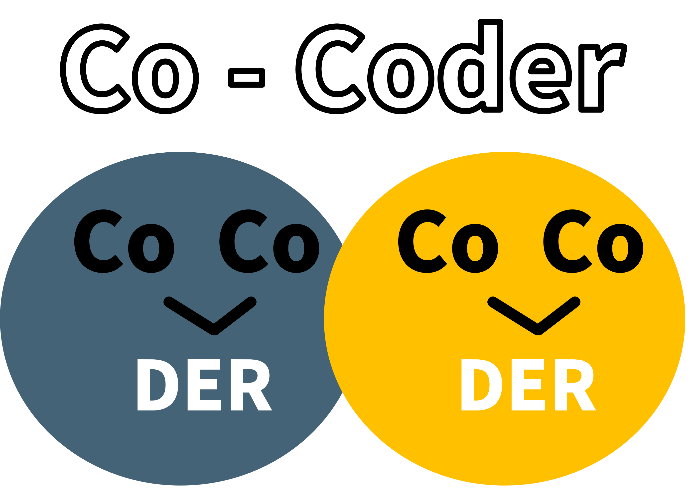

Development Status :: 3 - Alpha


<p align="center">
<a href="https://bard.google.com/"><br>
Interactive Python package that provides debugging hints in real time
</p>

<p align="center">
<a></a>
<a href="https://pypi.org/project/bardapi/"></a>
<!-- <a href="https://pepy.tech/project/bardapi"></a> -->
<a></a>
<a href="https://github.com/psf/black"></a>
<a href="https://www.buymeacoffee.com/parkminwoo"></a>
<a href="https://hits.seeyoufarm.com"></a>
</p>


This package is compatible with both Python and iPython. It enhances traceback error messages by appending hints and example codes related to the error. Prompt engineering allows you to get the answers you need quickly. With a one-time setup, you can receive debugging hints for multiple errors, saving time you would have spent searching on [StackOverflow](https://stackoverflow.com/) or Googling.

<br>


## Install
The latest stable release (and required dependencies) can be installed from PyPI:
```
pip install cocoder
```
You may instead want to use the development version from Github:
```
pip install git+https://github.com/dsdanielpark/Co-Coder.git
```

<br>

## Authentication
### Open AI
Visit [Open AI API](https://platform.openai.com/docs/introduction) for more information.
- Visit https://platform.openai.com/account/api-keys
- View API keys → + Create new secret key

### Google Bard
See the Python package [BardAPI](https://github.com/dsdanielpark/bardapi) for more information.
- Visit https://bard.google.com/
- F12 for console
- Session: Application → Cookies → Copy the value of  __Secure-1PSID cookie.

<br>

# Ipython

### With Open AI chat GPT
- Supported Language: English 
    ```python
    import cocoder.ipython
    import os
    os.environ['_OPEN_AI_API'] = 'sk-xxxxxxxxxxx'
    os.environ['_OPEN_AI_MODEL'] = "gpt-3.5-turbo" 
    # os.environ['_PROMPT_COMMAND'] = "You can make customized prompt in here. This variable will be merged with traced error message."

    print(1/0)
    ```

### With Google Bard
- Supported Language: Korean, English, Japanese

    *English*
    ```python
    import cocoder.ipython
    import os
    os.environ['_BARD_API_KEY'] = 'xxxxxxxxxxx'
    # os.environ['_PROMPT_COMMAND'] = "You can make customized prompt in here. This variable will be merged with traced error message."

    print(1/0)
    ```

    *Korean*
    ```python
    import cocoder.ipython
    import os
    os.environ['_BARD_API_KEY'] = 'xxxxxxxxxxx'
    os.environ["_BARD_ADVICE_LANG"]='ko'
    # os.environ['_PROMPT_COMMAND'] = "You can make customized prompt in here. This variable will be merged with traced error message."

    print(1/0)
    ```

    *Japanese*
    ```python
    import cocoder.ipython
    import os
    os.environ['_BARD_API_KEY'] = 'xxxxxxxxxxx'
    os.environ["_BARD_ADVICE_LANG"]='jp'
    # os.environ['_PROMPT_COMMAND'] = "You can make customized prompt in here. This variable will be merged with traced error message."

    print(1/0)
    ```


# Python
### With Open AI chat GPT
- Supported Language: English 
    ```python
    from cocoder import ExceptPyCocoder
    import os, sys
    os.environ['_OPEN_AI_API'] = 'sk-xxxxxxxxxxx'
    os.environ['_OPEN_AI_MODEL'] = "gpt-3.5-turbo" 
    # os.environ['_PROMPT_COMMAND'] = "You can make customized prompt in here. This variable will be merged with traced error message."

    sys.excepthook = ExceptPyCocoder.__call__
    print(1/0)
    ```

### With Google Bard
- Supported Language: Korean, English, Japanese

    *English*
    ```python
    from cocoder import ExceptPyCocoder
    import os, sys
    os.environ['_BARD_API_KEY'] = 'xxxxxxx'
    # os.environ["_BARD_ADVICE_LANG"]='ko','jp'
    # os.environ['_PROMPT_COMMAND']="You can make customized prompt in here. This variable will be merged with traced error message."

    sys.excepthook = ExceptPyCocoder.__call__
    print(1/0)
    ```


<br>

## Scripts
In the BardAPI scripts [folder](./scripts/), I have released a script to help you compare [OpenAI-ChatGPT](./scripts/openai_api.ipynb) and [Google-Bard](./scripts/google_api.ipynb). I hope they will help more developers.

## License
Just give me and [them](https://github.com/acheong08/Bard) a star.

## Bugs and Issues
Sincerely grateful for any reports on new features or bugs. Your valuable feedback on the code is highly appreciated.

## Contacts
:mortar_board: Core maintainer: [Daniel Park, South Korea](https://github.com/DSDanielPark) <br>
:envelope: E-mail: parkminwoo1991@gmail.com <br>

## Reference 
[1] https://github.com/acheong08/Bard
